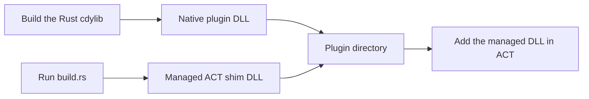

# Getting Started

## 1. Configure the Rust library

Create a Rust library that produces a native dynamic library:

```toml
[lib]
crate-type = ["cdylib"]

[dependencies]
ffxiv-act-native = "0.1"
```

## 2. Implement the plugin

Implement `Plugin`, choose the events to receive, and export the native entry point:

```rust
use ffxiv_act_native::{
    Event, Plugin, PluginInit, PluginResult, Repository, SubscriptionSet, export_plugin,
};

struct MyPlugin;

impl Plugin for MyPlugin {
    fn init(repository: Repository<'_>) -> PluginResult<PluginInit<Self>> {
        let _player_id = repository.current_player_id()?;
        Ok(PluginInit::new(
            Self,
            SubscriptionSet::ZONE_CHANGED | SubscriptionSet::LOG_LINE,
        ))
    }

    fn on_event(&mut self, _: Repository<'_>, event: Event<'_>) -> PluginResult<()> {
        eprintln!("{event:?}");
        Ok(())
    }

    fn shutdown(&mut self, _: Repository<'_>) -> PluginResult<()> {
        Ok(())
    }
}

export_plugin!(MyPlugin);
```

## 3. Generate the managed shim

Enable `embedded-contracts` as a build dependency to generate the shim without
requiring a local ACT or SDK installation:

```toml
[build-dependencies]
ffxiv-act-native = { version = "0.1", features = ["embedded-contracts"] }
```

Call `build_shim` from `build.rs`:

```rust,no_run
use ffxiv_act_native::{PluginConfig, PluginMetadata};

fn main() -> Result<(), Box<dyn std::error::Error>> {
    ffxiv_act_native::build_shim(&PluginConfig {
        assembly_name: "MyPlugin.ACT".into(),
        native_dll_name: "my_plugin.dll".into(),
        tab_name: "My Plugin".into(),
        metadata: PluginMetadata {
            file_version: [0, 1, 0, 0],
            product_version: "0.1.0".into(),
            file_description: "My ACT plugin".into(),
            product_name: "MyPlugin".into(),
            ..Default::default()
        },
    })
}
```

`tab_name` is the label shown on the ACT plugin tab. See the
[reference](reference.md#shim-configuration) for other metadata and generation options.

## 4. Build and install



Place only the two generated files in a dedicated plugin directory:

```text
MyPlugin/
├── MyPlugin.ACT.dll
└── my_plugin.dll
```

Enable the FFXIV Parsing Plugin in ACT first, then add `MyPlugin.ACT.dll`. The
Common SDK DLL is a build input and must not be copied beside the outputs. The
Rust DLL architecture must match the running ACT process.

## Runnable example

The example in [`examples/ffxiv-plugin`](../examples/ffxiv-plugin) writes zone
changes to `%TEMP%\FfxivActNativeExample.log` and generates its managed shim as
part of the build. It does not require an ACT or SDK installation.

```powershell
cargo build --manifest-path examples\ffxiv-plugin\Cargo.toml
```

Copy these files from `examples\ffxiv-plugin\target\debug` into the same plugin directory:

| File                            | Role                                  |
| ------------------------------- | ------------------------------------- |
| `FfxivActNativeExample.ACT.dll` | Managed DLL selected in ACT           |
| `ffxiv_plugin.dll`              | Native Rust plugin loaded by the shim |

For a release build, add `--release` and use `target\release` instead.
