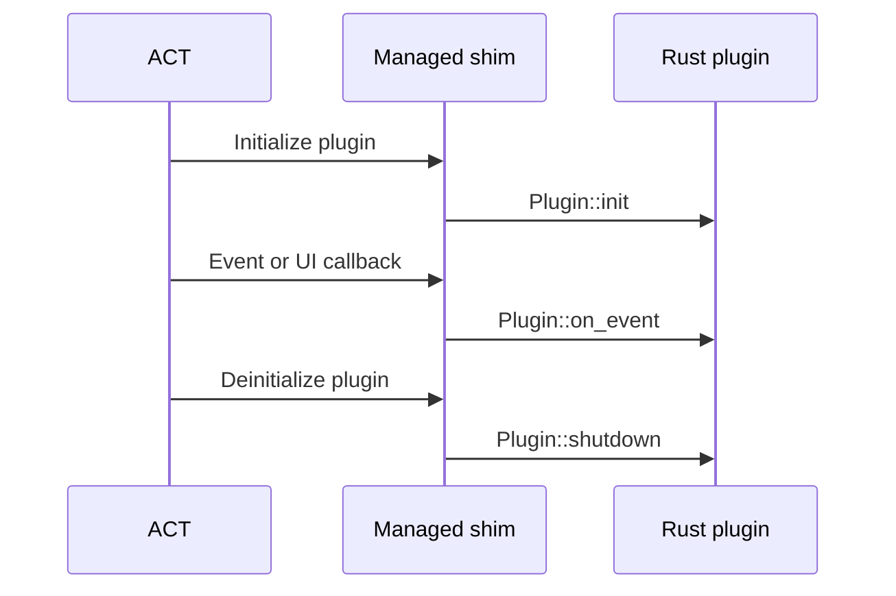

# Reference

## Runtime model

The managed shim connects ACT to the exported Rust plugin entry point:



Event callbacks are serialized in Rust. Borrowed data in `Event<'_>` and a
`Repository<'_>` must not be retained after a callback returns. Repository byte
results use `bytes::Bytes`; models and strings are owned values.

## UI

Use `Repository::ui` to add or update WinForms controls on the ACT plugin tab.
Commands are applied asynchronously, user actions arrive through `Event::Ui`,
and application failures are reported as `UiEvent::Error`.

```rust,no_run
use ffxiv_act_native::{Repository, UiCommand, UiControl};

fn add_ui(repository: Repository<'_>) -> Result<(), Box<dyn std::error::Error + Send + Sync>> {
    repository.ui(UiCommand::Add {
        parent: None,
        control: UiControl::Button {
            id: 1,
            text: "Refresh".into(),
        },
    })?;
    Ok(())
}
```

Control IDs must be unique within a plugin.

| Control    | Purpose                              |
| ---------- | ------------------------------------ |
| `Column`   | Vertical root or nested layout       |
| `Row`      | Horizontal layout                    |
| `Label`    | Read-only text                       |
| `Button`   | Click action                         |
| `CheckBox` | Boolean input                        |
| `TextBox`  | Text input                           |
| `ComboBox` | Item selection                       |
| `Number`   | Bounded numeric input                |
| `LogList`  | Log display with a maximum row count |

## Shim configuration

`PluginConfig` defines the managed assembly name, native DLL name, ACT tab name,
and `PluginMetadata`. Metadata can set assembly, file, and product versions plus
the file description, product name, company name, copyright, and comments.
`OriginalFilename` is derived from the assembly name.

When explicit contract assemblies are required, use the lower-level `generate` API:

```rust,no_run
use ffxiv_act_native::{PluginConfig, PluginMetadata, generate};

let act = std::fs::read(
    r"C:\Program Files\Advanced Combat Tracker\Advanced Combat Tracker.exe",
)?;
let common = std::fs::read(r"sdk\FFXIV_ACT_Plugin.Common.dll")?;
let shim = generate(
    &act,
    &common,
    &PluginConfig {
        assembly_name: "MyPlugin.ACT".into(),
        native_dll_name: "my_plugin.dll".into(),
        tab_name: "My Plugin".into(),
        metadata: PluginMetadata::default(),
    },
)?;
std::fs::write("MyPlugin.ACT.dll", shim)?;
# Ok::<(), Box<dyn std::error::Error>>(())
```

The generator reads `Advanced Combat Tracker.exe` and the official SDK's
`FFXIV_ACT_Plugin.Common.dll`. It does not use `FFXIV_ACT_Plugin.dll` as an input
or reference.

## Testing against an installed SDK

The real-SDK generation test is optional:

```powershell
$env:FFXIV_ACT_NATIVE_ACT_EXE = 'C:\path\Advanced Combat Tracker.exe'
$env:FFXIV_ACT_NATIVE_COMMON_DLL = 'C:\path\FFXIV_ACT_Plugin.Common.dll'
cargo test optional_real_sdk_generation
```
